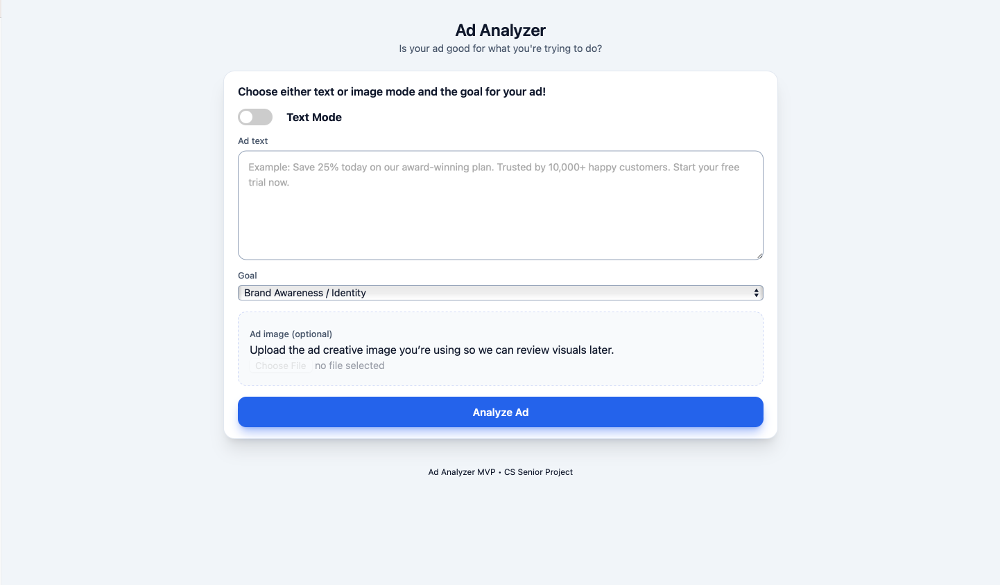
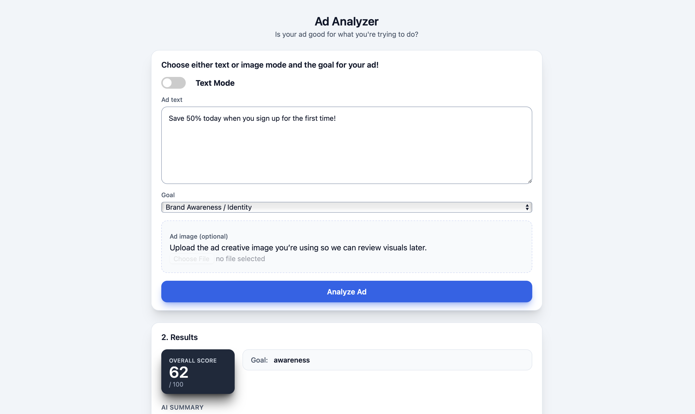
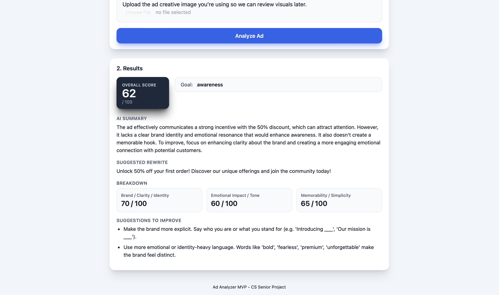
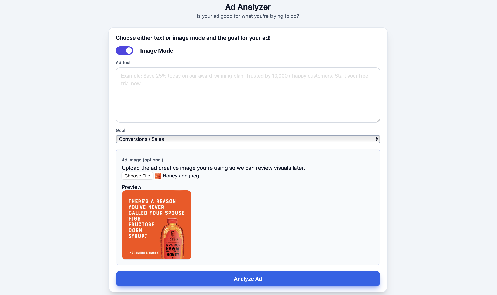
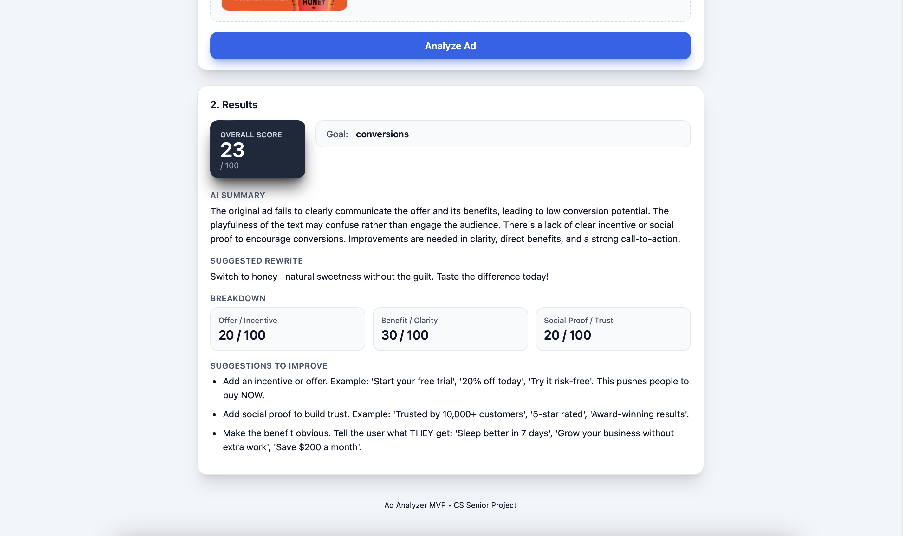

# AI Ad Analyzer

An AI-powered ad analysis tool that evaluates marketing ads using **OCR (Optical Character Recognition)** and **OpenAI’s API** to generate performance insights and actionable optimization recommendations.

---

## Screenshots

  

<table>
  <tr>
    <td align="center">
      
       <b>Text Analysis Score</b>
        
      
       <b>Detailed Text Breakdown</b>
    </td>
    <td align="center">
      
       <b>Image Analysis Score</b>
        
      
       <b>Image Insights</b>
    </td>
  </tr>
</table>

---

## 🌐 Live Website  
https://ai-ad-analyzer.onrender.com

*(Best experienced through the live site — no setup required.)*

---

## About the Project

This project was developed for a college capstone-style course with the goal of automating the evaluation of digital advertisements. Users can upload or input ad text, which is extracted using OCR and then analyzed by an AI model to assess performance and suggest improvements.

The system combines computer vision, backend engineering, and AI prompting to simulate how professional paid-ads teams review and optimize marketing creatives.

---

## Features

- **OCR Text Extraction** – Automatically reads text from uploaded ad images  
- **AI-Powered Analysis** – Uses OpenAI to evaluate ad effectiveness  
- **Performance Scoring** – Provides a numerical score based on campaign goals  
- **Ad Rewrite Suggestions** – Generates improved ad copy based on analysis  
- **Web Interface** – User-friendly frontend for uploading and viewing results  
- **End-to-End Pipeline** – From image → text → analysis → recommendations  

---

## Tech Stack

- **Frontend:** HTML, CSS, JavaScript  
- **Backend:** Node.js, Express  
- **AI:** OpenAI API  
- **OCR:** Tesseract OCR  
- **Deployment:** Render  

---

## My Contributions (Lead Developer)

Although this was a group project with two classmates, I led and implemented the core technical components of the system, including:

- **Backend Architecture** – Designed and built the Node.js + Express API  
- **AI Prompt Engineering** – Created and refined prompts for reliable analysis  
- **OCR Integration** – Implemented Tesseract to extract text from images  
- **Full Pipeline Implementation** – Connected OCR → AI analysis → frontend UI  
- **Deployment on Render** – Configured and deployed the live application  
- **Testing & Debugging** – Ensured stable performance and meaningful outputs  

---

## Example Use Case

1. Upload an image of a digital ad  
2. The system extracts text via OCR  
3. AI evaluates the ad based on a defined marketing goal  
4. The tool returns:
   - A performance score  
   - A breakdown of strengths/weaknesses  
   - A rewritten, optimized version of the ad  

---
